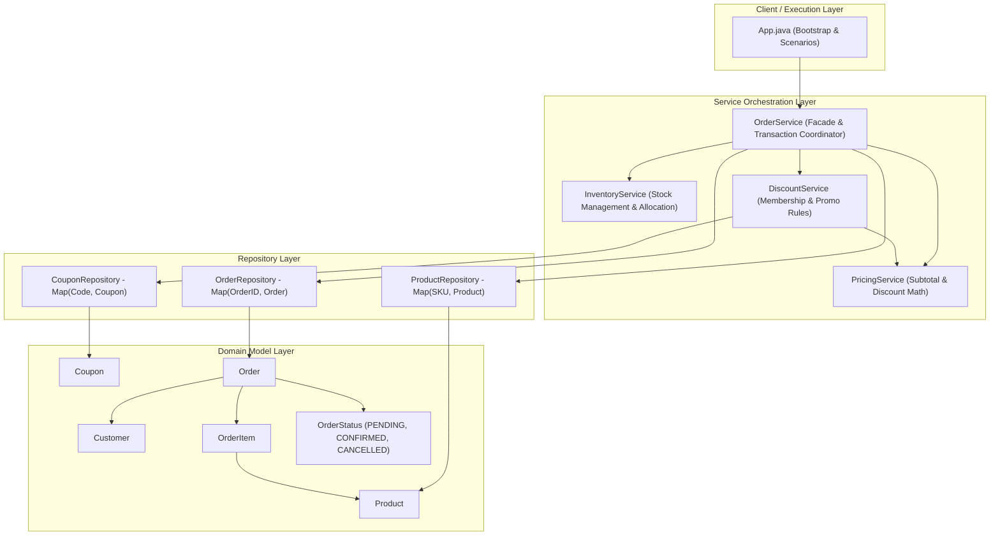

# Assignment 2: AI-Assisted Codebase Investigation (`order-service-app`)

**Project:** `order-service-app` (`com.rsl.orderservice`)  
**Investigated By:** Ankita Patil  
**Methodology:** Model Context Protocol (MCP) Filesystem Server + Antigravity AI  

---

## 1. Feature Location: Order Placement and Checkout

### The Feature (Order Placement) and What It Does
The order placement and checkout feature is the central business capability of `order-service-app`. It orchestrates the full lifecycle of turning customer purchasing intent into a validated, inventory-reserved, discounted, and confirmed commercial order.

Specifically, the feature carries out six critical responsibilities:
1. **Initializes Order State:** Instantiates a new `Order` entity, attaching customer identity and optional promotional coupon codes.
2. **Validates & Reserves Physical Stock:** Looks up catalog products by SKU, verifies stock availability in inventory, and deducts the requested quantities atomically. If insufficient stock exists for any line, the transaction is rejected.
3. **Itemizes the Order:** Computes line items and totals (`priceCents * quantity`) and adds them to the order.
4. **Calculates Gross Pricing:** Aggregates line totals into an order subtotal.
5. **Evaluates & Applies Discounts:** Evaluates customer loyalty membership (5% discount) and validates promotional coupon codes against registered promotions, gracefully handling mistyped or unrecognized coupons without crashing.
6. **Finalizes & Persists:** Computes the net total (`subtotal - discount`), updates the order status to `CONFIRMED`, persists the order in the repository, and emits structured audit logs.

### Entry-Point Identification
- **Entry-Point Class:** `com.rsl.orderservice.service.OrderService` (`src/main/java/com/rsl/orderservice/service/OrderService.java`)
- **Entry-Point Method:**
  ```java
  public Order placeOrder(String orderId, Customer customer, List<String[]> lines, String couponCode)
  ```
- **Discovery Method:** The Filesystem MCP inspected `src/main/java/com/rsl/orderservice/service/` and reviewed service interfaces. `OrderService.java` acts as the primary facade coordinating `ProductRepository`, `InventoryService`, `PricingService`, `DiscountService`, and `OrderRepository`.

---

## 2. Related Classes & Component Responsibilities

The order checkout capability follows a clean 4-tier domain architecture: **Models**, **Repositories**, **Services**, and **Application Driver**.

| Layer | Class / Component | Responsibility |
| :--- | :--- | :--- |
| **Model** | `com.rsl.orderservice.model.Order` | Encapsulates the complete order contract: `id`, `customer`, `status` (`PENDING`, `CONFIRMED`, `CANCELLED`), `items`, `subtotalCents`, `discountCents`, `totalCents`, and `couponCode`. |
| **Model** | `com.rsl.orderservice.model.OrderItem` | Represents an individual cart line item containing a `Product` reference, `quantity`, and computes `lineTotalCents()` (`product.getPriceCents() * quantity`). |
| **Model** | `com.rsl.orderservice.model.Product` | Domain entity representing a catalog product: `sku`, `title`, `priceCents`, and `category`. |
| **Model** | `com.rsl.orderservice.model.Customer` | Represents an enrolled customer: `id`, `name`, and loyalty boolean flag `member`. |
| **Model** | `com.rsl.orderservice.model.Coupon` | Represents a discount promotion code: `code` and `percentOff`. |
| **Model** | `com.rsl.orderservice.model.OrderStatus` | Lifecycle enumeration: `PENDING`, `CONFIRMED`, and `CANCELLED`. |
| **Repository** | `com.rsl.orderservice.repository.ProductRepository` | In-memory key-value store (`Map<String, Product>`) for product entities keyed by SKU. |
| **Repository** | `com.rsl.orderservice.repository.CouponRepository` | In-memory key-value store (`Map<String, Coupon>`) for registered promotional coupons. Returns `null` for unknown codes. |
| **Repository** | `com.rsl.orderservice.repository.OrderRepository` | In-memory store (`Map<String, Order>`) providing persistence and retrieval by `orderId`. |
| **Service** | `com.rsl.orderservice.service.OrderService` | Orchestrator and application facade. Coordinates product lookup, stock reservation, subtotal pricing, discount calculations, status updates, and order saving. |
| **Service** | `com.rsl.orderservice.service.InventoryService` | Manages real-time stock levels. Exposes atomic `reserve(sku, quantity)` to safely deduct stock only when sufficient units are available. |
| **Service** | `com.rsl.orderservice.service.PricingService` | Calculates order subtotal by summing line items, and computes absolute cash discounts from percentage values. |
| **Service** | `com.rsl.orderservice.service.DiscountService` | Evaluates total discount percentage based on member loyalty status (5%) and validated coupon codes, ensuring invalid coupons do not halt transactions. |
| **App / Driver** | `com.rsl.orderservice.App` | Application bootstrap class that wires dependencies, seeds test data, and runs end-to-end checkout scenarios. |
| **Utility** | `com.rsl.orderservice.util.AppLogger` | Configures unified single-line logging to both standard console output and the local log file `logs/app.log`. |

---

## 3. End-to-End Execution Flow Trace

When `OrderService.placeOrder(orderId, customer, lines, couponCode)` is called, the request executes through the following sequence:

```mermaid
sequenceDiagram
    autonumber
    actor Caller as App / Scenario Runner
    participant OS as OrderService
    participant PR as ProductRepository
    participant IS as InventoryService
    participant PS as PricingService
    participant DS as DiscountService
    participant CR as CouponRepository
    participant OR as OrderRepository
    participant Ord as Order (Entity)

    Caller->>OS: placeOrder(orderId, customer, lines, couponCode)
    OS->>Ord: new Order(orderId, customer)
    OS->>Ord: setCouponCode(couponCode)

    loop For each [sku, qty] line
        OS->>PR: findBySku(sku)
        PR-->>OS: product
        OS->>IS: reserve(sku, qty)
        alt Insufficient Stock (available < qty)
            IS-->>OS: false
            OS-->>Caller: throws IllegalStateException("Insufficient stock for " + sku)
        else Stock Available
            IS-->>OS: true (stock deducted)
            OS->>Ord: addItem(new OrderItem(product, qty))
        end
    end

    %% Pricing Calculation
    OS->>PS: subtotalCents(order)
    PS->>PS: Sum item.lineTotalCents()
    PS-->>OS: subtotal (in cents)

    %% Discount Calculation
    OS->>DS: discountCents(subtotal, customer, couponCode)
    alt Customer is Member
        DS->>DS: percent += 5% (MEMBER_PERCENT)
    end
    alt Coupon Code Provided
        DS->>CR: findByCode(couponCode)
        CR-->>DS: coupon (or null)
        alt Coupon Found
            DS->>DS: percent += coupon.getPercentOff()
        else Coupon is Null (Unknown Code)
            DS->>DS: Log warning; percent += 0%
        end
    end
    DS->>PS: percentageDiscountCents(subtotal, percent)
    PS-->>DS: discount amount (in cents)
    DS-->>OS: discount

    %% Order Finalization & Save
    OS->>Ord: setSubtotalCents(subtotal)
    OS->>Ord: setDiscountCents(discount)
    OS->>Ord: setTotalCents(subtotal - discount)
    OS->>Ord: setStatus(OrderStatus.CONFIRMED)
    OS->>OR: save(order)
    OR-->>OS: void
    OS-->>Caller: return confirmed order
```

### Detailed Invariants and Business Rules Checked
1. **Stock Availability Rule (`OrderService.java:71–73`):**
   - For every line item, `inventoryService.reserve(sku, qty)` verifies:
     $$\text{available}(sku) \ge qty$$
   - **Invariant:** Stock is never decremented below zero. If stock is insufficient, reservation returns `false`, and `OrderService` halts the transaction immediately with `IllegalStateException("Insufficient stock for <sku>")`.
2. **Subtotal Aggregation Rule (`PricingService.java:18–24`):**
   - Subtotal is strictly computed by summing line items:
     $$\text{subtotal} = \sum (\text{product.priceCents} \times \text{quantity})$$
3. **Membership Loyalty Rule (`DiscountService.java:46–48`):**
   - If `customer.isMember() == true`, an automatic 5% loyalty discount is granted.
4. **Coupon Validation Rule (`DiscountService.java:50–58`):**
   - If a coupon code is supplied, `couponRepository.findByCode(couponCode)` is queried.
   - If valid, the coupon's percentage off is stacked on top of member discounts.
   - If unknown, the system logs a warning, skips adding coupon percentage, and preserves checkout without throwing an exception.
5. **Cash Discount Formula (`PricingService.java:34–36`):**
   $$\text{discountCents} = \frac{\text{subtotalCents} \times \text{percent}}{100}$$
6. **Order State Invariant (`OrderService.java:80–85`):**
   - Net total is guaranteed to be: $\text{totalCents} = \text{subtotalCents} - \text{discountCents}$.
   - Order status transitions from `PENDING` to `CONFIRMED` upon successful persistence in `OrderRepository`.

---

## 4. High-Level Architecture Summary

`order-service-app` exhibits a modular **Layered Architecture** adhering to Separation of Concerns:



### Architectural Highlights:
1. **Separation of Concerns:** Business policies (discounts, pricing, stock reservation) are cleanly separated into dedicated services instead of accumulating within the `OrderService` coordinator.
2. **Unidirectional Dependencies:** Dependencies point strictly downward from presentation/app to services, repositories, and domain models. Entities remain decoupled from persistence and business rules.
3. **Encapsulated State Mutation:** Inventory reservations and order state changes occur through well-defined service contracts, preventing invalid partial orders from being persisted.

---

## 5. Engineering Reflection: AI + Filesystem MCP vs. Manual Reading

> *"Using AI paired with a scoped Filesystem MCP server transformed the investigation of `order-service-app` from a tedious manual file scan into an active, precision-guided analysis. Instead of tracing call hierarchies manually across multiple files, the AI leveraged structural MCP file reads to instantly locate the `placeOrder` entry point, verify domain invariants across `InventoryService` and `DiscountService`, and generate accurate sequence diagrams in seconds. This eliminates cognitive context-switching and makes onboarding into unfamiliar codebases fast, reproducible, and verifiable."*
